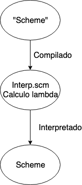

Neste documento propomos uma temática de trabalho para a cadeira de Semântica Formal.

# Proposta
Propomos para esse trabalho um projeto de implementação de um interpretador, de um interpretador, de *Scheme* em *Scheme*.
Mais detalhadamente, usaremos a linguagem *Scheme* para definir um interpretador de calculo $\lambda$ e usaremos o sistema de macros de *Scheme* para compilar de um *sub-set* de *Scheme* para o nosso cálculo $\lambda$. Um diagrama segue:

{width=30% height=30%}
